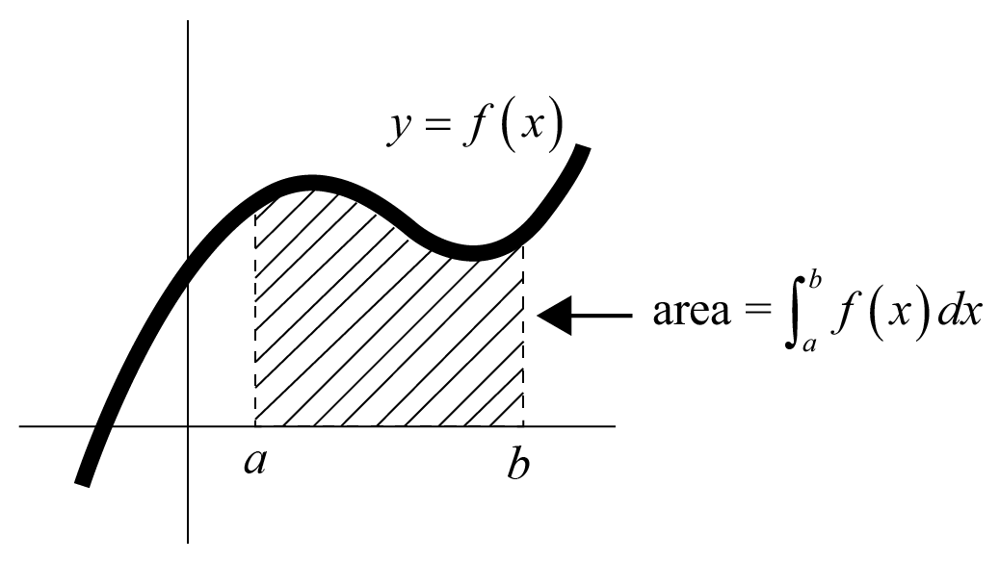
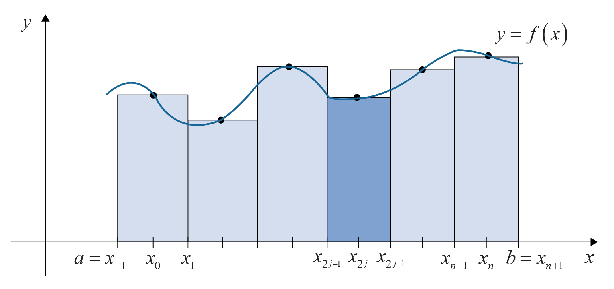
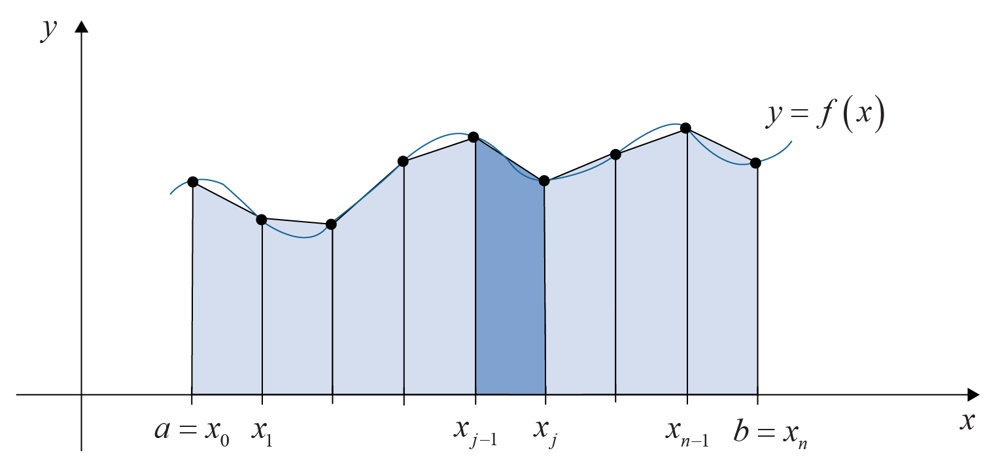
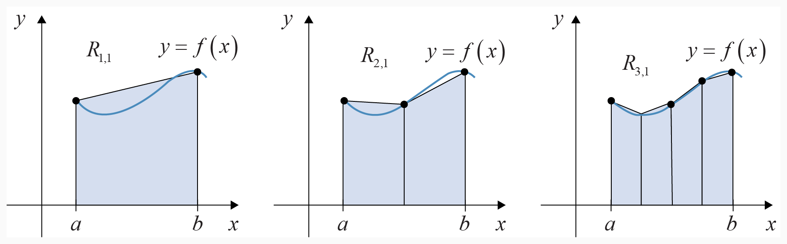
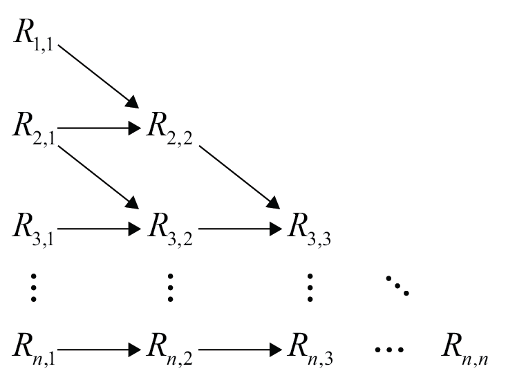
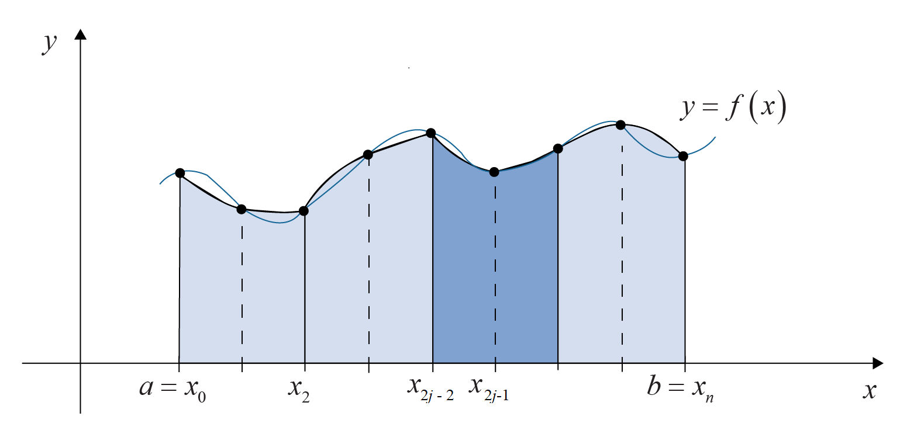
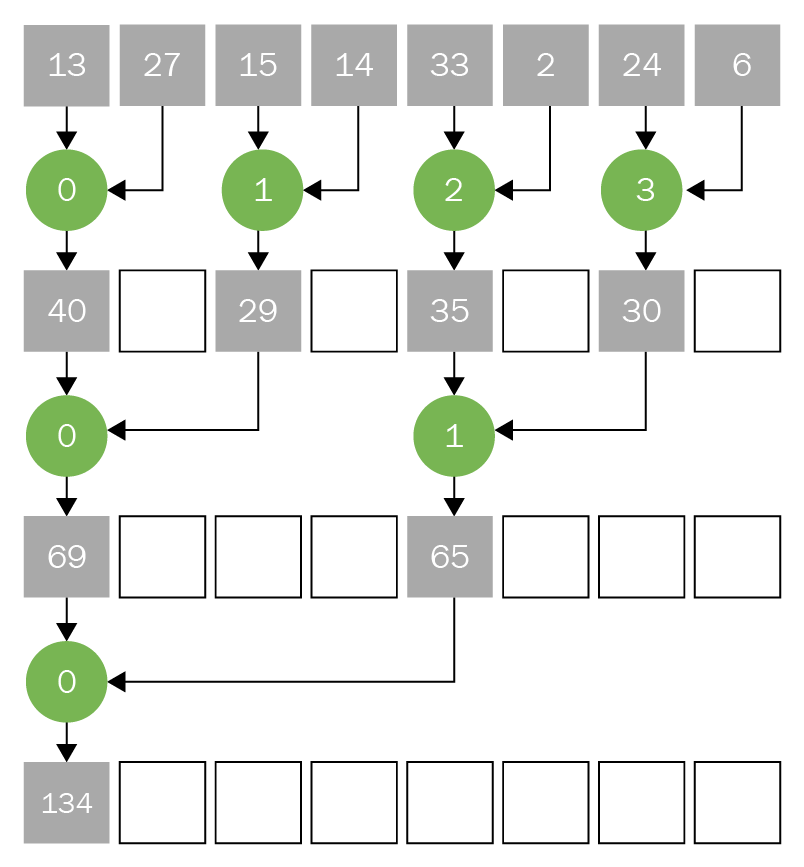
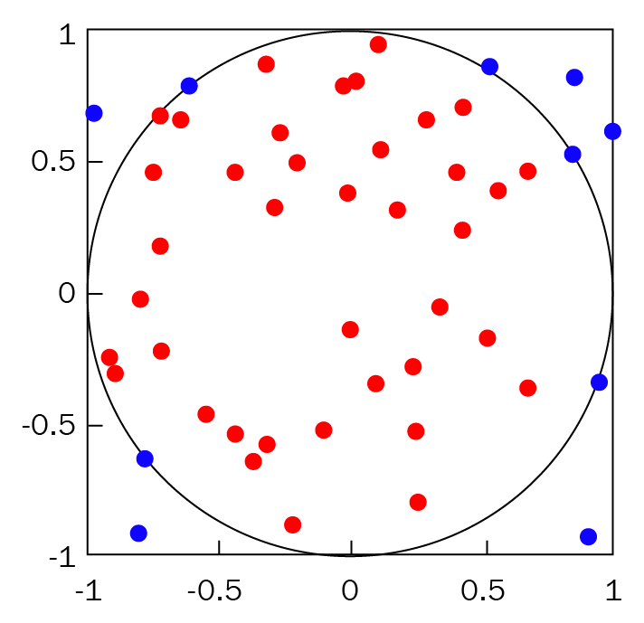

# Numerical quadrature in CUDA with reusable software

In many practical technical and scientific problems, analytically computing integrals can be difficult or even impossible. Nevertheless, engineers or scientists do not really need a beautiful formula expressing the integrals they are dealing with, but they just need numbers with a sufficient degree of precision. Furthermore, in many problems, iterative processes need calculating integrals of different integrand functions a very large number of times. There is thus the need for numerically computing integrals in a short time.  
Fortunately, throughout the literature, a very large number of *numerical integration techniques*, also known as *quadrature techniques*, are available. As we will see, implementing numerical integration traces back to the problem of computing the sum of sequences, a problem that is very well suited to CUDA acceleration.  
In this project, we will be covering the following topics:

  - Numerical quadrature with CUDA;
  - One-dimensional integration as a reduction problem;
  - Parallel reduction;
  - One-dimensional integration with reusable software (Thrust, CUB, and ModernGPU);
  - Two-dimensional Monte Carlo integration;
  - Repeated Weddle’s quadrature.

By the end of the project, the Readers will learn the basic aspects of a very common operation in parallel programming, namely, reduction. Furthermore, they will become familiar with the underlying philosophy behind four main libraries used in CUDA, namely, Thrust, CUB, ModernGPU and cuRAND. Finally, they will approach the basic operations implemented
by the above three libraries, and, in particular, reduction and random number generation.  
Knowing of Thrust, CUB, ModernGPU, and cuRAND will make you in a position to avoid reinventing the wheel in order to implement basic CUDA operations or more involved approaches by combining the off-the-shelf routines of these libraries.

## Getting started

The key elements of numerical integration required to understand the codes will be provided on a detailed level and the exploited CUDA libraries briefly recalled.  
As prerequisites, fundamentals of C++ template programming and C++ Standard Library are required. Also, some knowledge of lambda functions is necessary for understanding the ModernGPU case.  

## Numerical quadrature with CUDA

Writing a CUDA code simultaneously reaching high performance and being portable across different GPU architectures is a complicated task since it requires the Programmer to master a vast knowledge of the underlying hardware and take full advantage of the relevant features of the CUDA programming model.  
Fortunately, many codes can be reorganized in terms of primitive operations. Many times, such primitive operations amount to *scan*, *reduce* or *sort*. Some other times, they coincide with the Fast Fourier Transform (FFT), with linear algebra manipulation operations or with primitives for the generation of random numbers. Moreover, the CUDA
ecosystem makes many libraries available. These libraries implement the mentioned operations in a reliable, portable, efficient, and effective way so that the complexities and details of the underlying device and CUDA programming model are abstracted away.  
Such libraries include Thrust, CUB, ModernGPU, CUDPP, cuSPARSE, cuRAND, cuFFT and so on. In this project, we will see four of them at work, namely, Thrust, CUB, ModernGPU, and cuRAND. They will be applied to a very common problem in numerical computation, namely, numerical integration or quadrature.  
We will, in particular, consider the numerical integration of real functions of one or two real variables. In the one-dimensional case, quadrature rules based on Romberg’s and Simpson’s quadratures will be considered, while, in the two-dimensional case, we will deal with Monte Carlo integration. In the former case, the problem essentially amounts
to a reduction problem, namely, the summation of a certain number of elements, while, in the latter case, the key point is the reliable generation of random numbers.  
Thrust, CUB, and ModernGPU will be of help in the one-dimensional case, thanks to their ability to perform reduction operations. cuRAND and Thrust will be the main actors in the two-dimensional case thanks to their capability to fastly and reliably generate random numbers.   
Throughout this project, one-dimensional numerical integration will amount at computing the integral:

<p align="center">
         [1]
</p>

where  is a real function of a single real variable.  
The two-dimensional numerical integration will amount at calculating the integral:

<p align="center">
         [2]
</p>

where  is a real function of two real variables and  is the integration domain.  
Let us break the seal and start with the technical details of one-dimensional integration. Next section will be rather technical, but no worries: implementations and fun will come shortly.

## Theory: understanding one-dimensional integration

In the one-dimensional case, numerical integration consists of estimating the area subtended by the curve  with  (see figure [1](#integration)). The idea underlying many one-dimensional numerical integrations is operating along three steps.

1.  The first step is to divide the integration interval  into small intervals.
2.  The second step consists of approximating the integrals over the mentioned intervals according to rules like the midpoint rule, the trapezoidal rule or the Simpson’s rule which will be dealt with in the following. Of course, there are many other rules that are not covered in this project. For example, the midpoint rule, the trapezoidal rule, and the Simpson’s rule consist of approximating the integrand function by zeroth, first and second-order polynomials, respectively, over the integration sub-intervals of the domain  by Lagrange interpolation. Using higher-order polynomial approximations would lead to general Newton-Cotes integration, which will not be covered throughout the present project. Another possibility not covered throughout the project regards Clenshaw-Curtis or Fejér quadrature using Chebyshev polynomials instead of Lagrange interpolation. Obviously, there are many other possible numerical integration rules not mentioned here.
3.  The third step amounts to adding such various approximations to obtain a whole integral approximation.

Besides dividing the integration domain  into smaller intervals, we mention that other numerical integration rules exist which operate differently. For example, Gaussian quadrature consists of yielding exact results for integrand functions which are polynomials up
to a pre-fixed degree or less by a suitable choice of the nodes and weights and is often more accurate than Newton-Cotes for smooth integrands. Also, adaptive quadratures like the Gauss-Kronrod quadrature could be a possibility.  
Nevertheless, from the parallel programming point of view, one-dimensional numerical integration can be dealt with in general as a reduction problem of a sequence of samples multiplied by a sequence of weights. To convince ourselves that numerical integration is essentially a reduction operation, in the next subsection, we will illustrate the
so-called *composite midpoint rule*.  
The following image shows the area subtended by the curve  with :

<p align="center">
  
  <br>
     <em>Figure 1. The integration problem.</em>
</p>

The integral that we are interested in equals the shadowed area and, throughout the following sections, we will address techniques aimed at approximating such kinds of area.  
As promised, let’s start with a simple quadrature rule - namely, composite midpoint rule. The idea behind this technique is to approximate the area subtended by the curve  as a collection of rectangles, which is very intuitive and easy to understand. This will convince us that a cornerstone of implementing numerical integration in CUDA is the capability of performing the summation of a sequence of numbers, namely, of performing a *reduction*.

### Composite midpoint rule

In this subsection, we will shortly discuss the composite midpoint rule. Actually, we will not present the CUDA implementation with reusable software of the composite midpoint rule: in the present project, we will prefer to focus on more complicated quadrature rules and the knowledge gained on them will put us in a position to easily implement simpler
integration schemes. Accordingly, composite midpoint rule will serve only to break the ice now. Later on, Romberg integration and Simpson’s rule, subject of implementations, will be shortly described.  
The composite midpoint rule is shortly described by the below points.

1.  For a twice differentiable function , composite midpoint rule consists of subdividing the integration domain  in  intervals of equal width  with  and  even, which can be seen in figure [2](#midpoint). The various integration intervals have discretization points , . In each integration interval, the integrand is assumed to be constant and equal to its value at the interval midpoint, namely .
2.  In this way,  is approximated as the sum of the areas of  rectangles having bases equal to  and heights equal to . Consequently, the integral at hand is equal to the following equation: 
<p align="center">
         [3]
</p>

In equation [\[3\]](#midpointRule),  is the numerical approximation of  according to the composite midpoint rule, namely, the summation on the right hand side. The subscript *MR* stands for *midpoint rule* and the dependence on the size  of the discretization interval has been highlighted in . On the other side, the term    is the error made by approximating  with . As we can see, the expression of the error term involves the second derivative of , namely, , evaluated at a point  of .  
In equation [\[3\]](#midpointRule), the expression of the error term tells us that:

  - There exists a point  of  for which , but it does not tell how to construct .
  - The error  decreases with  as .
  - If the second-order derivative of  vanishes, then  is an exact evaluation of ; the second-order derivative vanishes for linear functions, namely, for first-order polynomials.  
    Equation [\[3\]](#midpointRule) reaches the goal that we have set, namely, to convince ourselves that the evaluation of  amounts to a reduction. In the case of the composite midpoint rule, we need to reduce the elements of  and multiply them by .

Nevertheless, with the knowledge acquired at the end of this project, the interested Reader will be in a position to implement the composite midpoint rule by himself. The following image shows an example for the composite midpoint rule:

<p align="center">
  
  <br>
     <em>Figure 2. Composite midpoint rule.</em>
</p>

As it can be seen, over each integration interval, the integrand is approximated as a rectangular window whose height equals the value of the function at the midpoint of each integration interval.   
Let us now enter the heart of the implementations by describing the composite trapezoidal rule on which our CUDA Romberg integration code is based.

### Composite trapezoidal rule

Improvement with respect to the composite midpoint rule is the *composite trapezoidal rule*. In the following, the composite trapezoidal rule is shortly described.

1.  It consists again into dividing the integration domain , this time into  intervals , with , of width equal to  and with
    discretization points .
2.  However, this time, the integral  is approximated as the sum of  trapezoids of height  and bases  and , see figure [3](#trapezoidal). In other words,
<p align="center">
         [4]
</p>

For the terms  and , similar considerations hold as for  and .  
Figure [3](#trapezoidal) below illustrates the composite trapezoidal rule:

<p align="center">
  
  <br>
     <em>Figure 3. Composite trapezoidal rule.</em>
</p>

The previous image shows that the integral is obtained as the summation of the areas of trapezoids which are obtained by linear approximations of the integrand within each integration interval.  
A frequent desire of engineers or scientists is to control the accuracy by which the integrals are approximated. Therefore, Romberg integration is a worthwhile method to be interested in.

### Romberg integration

Let us now turn to Romberg integration which is a numerical integration scheme very often used in applications thanks to its capability to achieve arbitrarily accurate integral estimates. For the sake of simplicity, but with no loss in generality, we will discuss Romberg integration in connection to composite trapezoidal rule, although it could be used in connection to more accurate schemes, as Simpson’s rule discussed below.  
We will lead the description of Romberg integration as the following subsequent steps:

1.  Composite trapezoidal rule and its error term;
2.  Richardson’s extrapolation technique;
3.  The Romberg scheme applying Richardson’s extrapolation to composite trapezoidal rule.

We will explore these instructions on a step-by-step basis in the following sections.

#### Deriving composite trapezoidal rule and its error term

When  is indefinitely derivable with continuous derivatives, then the error term in equation ([\[4\]](#trapezoidalRule)) can be given expression as:

<p align="center">
         [5]
</p>

where , , , , depend only on the derivatives of  at  and .  
Now let’s move on to using Richardson’s extrapolation technique.

#### Using Richardson’s extrapolation technique

Romberg integration uses Richardson’s extrapolation which can be exploited to improve the accuracy of an approximation once a parametric model of the error is known. In our case, the parametric model of the error is . Richardson’s
extrapolation does not require to know the coefficients ,
, , . The following steps schematically describe Richardson’s extrapolation technique:

1.  Let us suppose that an approximation has been obtained for a certain choice of the number  of discretization intervals. We denote by  such an approximation for which the further subscript  stands for the first step of an iterative process. According to equation [\[5\]](#trapezoidalRuleRomberg), we have:
    
    <p align="center">
             [6]
    </p>

    Of course, in equation [\[6\]](#iterationRomberg), the *step*  depends on . From equation [\[6\]](#iterationRomberg), it can be seen that  has an accuracy .
2.  Let us now assume to double the number of discretization intervals . This means that the discretization step halves and so:
    
    <p align="center">
             [7]
    </p>

    After multiplying equation [\[7\]](#newIterationRomberg) by  and subtracting equation [\[6\]](#iterationRomberg), then we have:
    
    <p align="center">
             [8]
    </p>
    
    On regarding  as a new approximation of , then such a new approximation has a better  accuracy than . It is possible to reiterate Richardson’s extrapolation and applying it to:
    
    <p align="center">
             [9]
    </p>

3.  It can be seen that a new approximation  is reached and given by:
    
    <p align="center">
             [10]
    </p>

    It has  accuracy.

4.  The process stops when the desired accuracy is achieved.

#### The Romberg scheme for the composite trapezoidal rule

More concretely from the codeic point of view, Romberg integration is an iterative process using composite trapezoidal rule, in our case, for different values of  as , where  is the maximum number of iterations of the approach and dictates the final accuracy. The approach proceeds by building up a lower triangular matrix  with  and . In a preliminary step, the entire first column ,  is computed, see figure [4](#romberg).  
The generic term  corresponds to the approximation in equation [\[5\]](#trapezoidalRuleRomberg)
obtained by applying the composite trapezoidal rule to the case of  discretization steps. In other words:

<p align="center">
             [11]
</p>
    
Then, Romberg integration proceeds according to figure [4](#romberg). In particular, starting from  and , a better approximation is constructed according to equation [\[8\]](#rombergRearrangement). Such a new
approximation is denoted by  and equals:

<p align="center">
             [12]
</p>

Later on, starting from  and , and again following equation [\[8\]](#rombergRearrangement), an improved approximation, denoted by , is set up, namely:

<p align="center">
             [13]
</p>

Furthermore, starting from  and   and according to equation [\[10\]](#lastIterationRomberg), a better approximation is build-up, namely:

<p align="center">
             [14]
</p>

In general, the term , with , is provided by:

<p align="center">
             [15]
</p>

Figure [4](#romberg) illustrates the first column of the Romberg matrix whose generic element is :

<p align="center">
  
  <br>
     <em>Figure 4. Illustrating the first step of Romberg
integration.</em>
</p>

The previous figure [4](#romberg) shows the refinement process of the integral calculation by the composite trapezoidal rule when the integration domain is divided into an increasing number of intervals. Furthermore, the Romberg iterations of equations [\[11\]](#firstColumnRomberg)-[\[15\]](#genericTermRomberg) are summarized in figure [5](#rombergIterations):

<p align="center">
  
  <br>
     <em>Figure 5. Romberg iterations.</em>
</p>

As it can be seen, Romberg iterations construct a lower triangular matrix.  
Having the Romberg integration scheme available is useful from the application point of view and can be satisfactory in a large number of cases. It is an iterative method and the programming part related to CUDA can be easily implemented as we will see shortly. However, in some cases, avoiding iterative techniques can be preferable, so that, to achieve a satisfactory accuracy, higher-order polynomial approximations of the integrand function, as used by composite Simpson’s rule, can be needed.  
For this reason, composite Simpson’s rule will be the subject of the next section. Moreover, the implementation part related to CUDA exhibits some more complexities as compared to the Romberg scheme, so that composite Simpson’s rule enables us to highlight some programming points which can be also of general interest.

### Composite Simpson’s rule

Finally, let us illustrate the composite Simpson’s rule, namely, the second and last integration scheme for one-dimensional functions that we will use in the implementations and that represents an improvement as compared to the composite midpoint and trapezoidal rules.   
The following points describe composite Simpson’s rule:

1.  Composite Simpson’s rule consists of discretizing the interval  at the  points , . Assuming  even, then, in each interval , , function  is approximated by a second-order polynomial as in figure [6](#compositeSimpson), that is:
    
    <p align="center">
             [16]
    </p>

2.  As a result, we have:
    
    <p align="center">
             [17]
    </p>
    
    where  is the Simpson’s rule approximation of the integral and  is the related error; two points are worth to be underlined:  decreases with  as ; if the fourth-order derivative of  vanishes, then  is an exact evaluation of ; the second-order derivative vanishes for polynomials up to the third order; accordingly, accuracy is improved as compared to the composite midpoint and trapezoidal rules.

The following figure [6](#compositeSimpson) illustrates composite Simpson’s rule:

<p align="center">
  
  <br>
     <em>Figure 6. Composite Simpson’s rule.</em>
</p>

Figure [6](#compositeSimpson) highlights that, in each integration interval, the integrand is approximated by a quadratic function.  
If we compare the above figure with figure [3](#trapezoidal), we can understand that composite Simpson’s rule amounts to the integrand function with a smoother approximation which is the reason for the better accuracy. Many routines of the CUDA ecosystem make parallel reduction routines available. Of course, the specific implementation
changes from case to case, but the underlying philosophy stays roughly the same.  
In the next section, we will look at parallel reduction and illustrate such philosophy because it is always recommendable to have some knowledge of what is inside the routines, avoiding to use them as black boxes.

## Theory: Parallel reduction

In this section, we sketch general guidelines, typically followed by libraries like Thrust, CUB or ModernGPU, to perform the parallel summation of  numbers. Thrust, CUB, and ModernGPU are the libraries we will use below and are perhaps the most widely employed by CUDA programmers. Thrust is the highest level among the three since it hides almost completely the underlying implementation under an abstraction layer.  
It has been molded according to the C++ STL library and works both for GPUs and for multi-core CPUs. CUB and Modern GPU are more low level and do not hide the underlying program structure. CUB is intended to optimize performance while Modern GPU to maximize readability and editability.  
The sum of  numbers is called *a reduction* since it *reduces*  elements to a solitary one, namely, the result of the summation.  
The reduction may appear at a first glance an intrinsically sequential operation. On a sequential machine, it would be trivially implemented by a `for` loop in which, iteration by iteration, the current element is summed up to an accumulator. Fortunately, the reduction is amenable to a parallel implementation by exploiting a common codeic scheme known as *divide et impera* or *divide and conquer*. The divide et impera technique consists of three steps:

1.  recursively dividing the original problem into smaller subproblems of the same type until a certain minimum size is reached;
2.  solving the subproblems obtaining partial solutions;
3.  combining the partial solutions to achieve the solution of the original problem.

The divide et impera scheme is applied when the complexity of obtaining the partial solutions and recombining them is less than that of solving the whole problem at once.  
The parallel reduction is illustrated in figure [7](#parallelReduction) below and can be thought of as built up in different steps:

<p align="center">
  
  <br>
     <em>Figure 7. Parallel reduction.</em>
</p>

On referring to figure [7](#parallelReduction), let us assume, for the sake of illustration, that , namely, that  is a power of . The first two
steps are detailed further.

1.  In the first step,  threads operate. Each thread takes over  consecutive elements of the sequence to be reduced, adds them up and temporarily stores them in one of the available memories of the GPU, as the global memory or the shared memory. In this way, at the end of the first step, a new *partially reduced* sequence is created whose length is  and for which each element is the result of the summation of  elements of the original sequence.
2.  In the second step,  threads operate. As for the first step, each thread takes over  consecutive elements of the new sequence of  elements, adds them up and temporarily stores them again in one of the available memories of the GPU (global or shared).

Iterating this approach, it can be understood that the number of required steps drops from the  needed in the sequential case to  of the parallel case. If, ideally, each step requires a clock cycle, then the large speedup attainable in the parallel case as compared to the sequential one can be figured out.   
Two key points of this scheme should be pointed out:

  - The first point regards the fact that the threads should collaborate with each other. *Collaboration* means that the threads should be able to share the results of the intermediate sums attained step by step. More in detail, the intermediate results should be temporarily stored so that they can be recovered by the threads at the following
    step. A first candidate memory to this purpose is *global memory*. Of course, such a choice would be non-performing due to the “slowness” of global memory, being it *off-chip*. Among the *on-chip* memories, which are to be preferred since they are faster, one could choose *registers* which are the fastest storage units available on a GPU. Unfortunately, the visibility of registers is *per-thread* or, at most, *per-warp*, thanks to mechanisms, like *shuffle operations*, enabling the sharing of data among threads
    belonging to the same warp. An intermediate solution between global memory and registers is *shared memory* which is still an on-chip memory, and so faster than global memory, but somewhat slower than registers. Shared memory has the merit of being accessible by all the threads in a thread block. 
  - The second key point concerns the organization of threads in blocks. Such an organization is purposely performed to enable collaboration among threads. According to what underlined with reference to the need for “temporary” memories, a parallel reduction code can be devised by appointing each thread block the task of reducing a subset of elements whose number corresponds to the number of active threads in the block.

Later on, the results of the block summations can be further reduced by a single thread of the block, typically the thread with index `0`, using atomic operations and accumulating the result in a global memory location. With this *per-block* reduction, shared memory can be used to load the data from global memory at the first reduction step or to store intermediate results at the subsequent steps. When the number of active threads becomes equal or less than those of a warp, then registers and shuffle operations come into play.  
As it can be seen, the use of libraries hides away the implementation details, thus simplifying the reduction in CUDA. In the next section, we will learn how implementing Romberg integration with Thrust and composite Simpson’s rule with Thrust, CUB, and ModernGPU.

## Practice: one-dimensional integration with reusable software

Initially, Thrust will be used to implement both Romberg integration and composite Simpson’s rule. Later on, CUB and ModernGPU will be exploited to implement the composite Simpson’s rule as well. The use of each library will be premised with a short description of the library itself.  
In all the below examples, the computation of the following integral will be considered:

<p align="center">
         [18]
</p>

Moreover, single-precision computations will be dealt with. Of course, the presented codes could be easily customized to enable the computation of other one-dimensional integrals, possibly in double precision.  
Let us understand Thrust next.

### Thrust

Thrust is the parallel analog of the C++ Standard Template Library (STL). Programmers being familiar with C++ STL will have no difficulty in using Thrust since the syntax of the latter faithfully retraces that of the former.  
Thrust enables high productivity in writing CUDA codes since many complex operations like *reduce*, *scan*, *conditional copies*, and so on are rendered with a single, simple call. Thrust abstracts all the underlying implementation details of those complex operations, including the parameters influencing the code optimization, as, for example, the
launch grid. Thrust, indeed, performs a transparent tuning of the code while guaranteeing the portability across different GPU architectures.  
Thrust is an *include-only*, or *header-only*, library that is shipped with CUDA and requires no extra installation. It is also *architecture-agnostic* which means that the same code can be executed on a multi-core CPU or a GPU without any main special adaptation.  
We will now understand Thrust implementation using both Romberg integration and composite Simpson’s rules.

#### Using Romberg integration with Thrust

In order to implement Romberg’s technique with Thrust, we need the steps which are illustrated below:

1.  We define the problem parameters, namely, the extremes of integration `a` and `b` as well as the maximum number of iterations `Kmax`. This is done by the following lines:
    ``` c++
    float a = 0.5f;
        float b = 1.f;
        int Kmax = 5;
    ```
2.  We allocate memory space for Romberg’s matrix `R`. Notice that such space is allocated *on the host* by:
    ``` c++
    thrust::host_vector<float> R(Kmax * Kmax, 1.f);
    ```
    Later on, we need two `for` loops.
3.  The first `for` loop computes the first column of Romberg’s matrix, namely, the integrals , . This is the only part where the use of GPU intervenes in the present example. Within this `for` loop, the discretization step `h` and the number of discretization points `N` are defined as:
    ``` c++
    float h = (b - a) / pow(2.f, k + 1);
        int N = (int)((b - a) / h) + 1;
    ```
    Moreover, memory space, this time on the GPU, is allocated for the  discretization points  by the following line:
    ``` c++
    thrust::device_vector<float> d_x(N);
    ```
    Then we invoke the following line:
    ``` c++
    thrust::sequence(d_x.begin(), d_x.end(), a, h);
    ```
    It enables afterwards to compute the discretization points as a sequence of  values starting from a and incremented with a step equal to `h`. Following the computation of the discretization points, space for the samples  is allocated in the vector `d_y` by:
    ``` c++
    thrust::device_vector<float> d_y(N);
    ```
    To cope with the use of Thrust, the integrand function is defined by a proper functor:
    ``` c++
    struct sin_functor {__host__ __device__ float operator()(float x)
            const { return sin(2.f * pi_f * x); } };
    ```
    The samples  are obtained by performing a transformation of the discretization points `d_y` by using the mentioned functor:
    ``` c++
    thrust::transform(d_x.begin(), d_x.end(), d_y.begin(), 
            sin_functor());
    ```
    The elements of matrix  are finally obtained, according to equation [\[11\]](#firstColumnRomberg), by
    performing a reduction by exploiting `thrust::reduce`. It should be noticed that `thrust::reduce` returns a host memory result, which is consistent with the fact that the matrix `R` is allocated on the host.
4.  Following these operations on the GPU, the elements of Romberg’s matrix are computed on the host according to equation [\[15\]](#genericTermRomberg) in a second `for`
    loop.

The code implementing Romberg’s technique with Thrust is shown below:

``` c++
#include <thrust/sequence.h>
#include <thrust/device_vector.h>
#include <thrust/host_vector.h>
#define pi_f 3.14159265358979f // Greek pi in single precision
    
struct sin_functor { __host__ __device__ float operator()(float x) 
        const { return sin(2.f * pi_f * x); } };

int main() {

    // --- Integration domain
    float a = 0.5f;
    float b = 1.f;

    // --- Maximum number of Romberg iterations
    int Kmax = 5;

    // --- Define the matrix for Romberg approximations and 
    //     initialize to 1.f
    thrust::host_vector<float> R(Kmax * Kmax, 1.f);

    // --- Compute the first column of Romberg matrix
    for (int k = 0; k < Kmax; k++) {

    // --- Step size for the k-th row of the Romberg matrix
    float h = (b - a) / pow(2.f, k + 1);

    // --- Define integration nodes
    int N = (int)((b - a) / h) + 1;
    thrust::device_vector<float> d_x(N);
    thrust::sequence(d_x.begin(), d_x.end(), a, h);

    // --- Calculate function values
    thrust::device_vector<float> d_y(N);
    thrust::transform(d_x.begin(), d_x.end(), d_y.begin(),
        sin_functor());

    // --- Calculate integral
    R[k * Kmax] = (.5 * h) * (d_y[0] + 2.f * thrust::reduce(
        d_y.begin() + 1, d_y.begin() + N - 1, 0.0f) + 
        d_y[N - 1]);}

    // --- Compute the other columns of the Romberg matrix.
    //     Remember that the Romberg matrix is triangular.
    for (int k = 1; k < Kmax; k++) {
        for (int j = 1; j <= k; j++) {

            // --- Computing R[k, j]
            R[k * Kmax + j] = R[k * Kmax + j - 1] + (R[k * Kmax + j - 1] -     
                R[(k - 1) * Kmax + j - 1]) / (pow(4.f, j) - 1.f);}}

    printf("The integral is %f\n", R[Kmax * Kmax - 1]);
    return 0;}
```
<p align="center" id="rombergThrust" >
     <em>Listing 1. Romberg integration with Thrust.</em>
</p>

We need two nested `for` loops to implement the computations in equation [\[15\]](#genericTermRomberg): the outer loop sweeps the rows, while the inner one sweeps the columns of the Romberg matrix. Since such a matrix is lower triangular, the outer loop runs `k` from `1` to `Kmax-1`, while the inner one runs `j` from `1` to `k`.  
We now move to composite Simpon’s rule integration with Thrust.

#### Using Composite Simpson’s rule with Thrust

Some parts of composite Simpson’s rule implementation with Thrust are common to Listing [1](#rombergThrust) and will not be repeated here. One of those examples is the integrand function which is still defined by means of a functor. Differently than before, now the number of integration nodes `N` is fixed by the user.  
The peculiar thing here is that, according to equation [\[17\]](#compositeSimpsonRule), from the programming point of view, composite Simpson’s rule essentially consists
of the reduction of the sequence:

<p align="center">
             [19]
</p>

The sequence can be obtained by an elementwise multiplication of the sequence

<p align="center">
             [20]
</p>

by the sequence

<p align="center">
             [21]
</p>

The sequence  requires the generation of an alternated sequence of ’s and ’s, apart from the first and last elements that are ’s, which can be achieved by the `steppedRangeClass` class.  
The first part of the `steppedRangeClass` class code is reported below:

``` c++

template <typename templateIterator>
class steppedRangeClass {

public:
typedef typename thrust::iterator_difference<templateIterator>::
    type differenceIteratorType;

struct relevantFunctor : public
    thrust::unary_function<differenceIteratorType, 
        differenceIteratorType> {
        
    differenceIteratorType step;
    relevantFunctor(differenceIteratorType step) : step(step) {}
        
    __host__ __device__ differenceIteratorType operator()(const
        differenceIteratorType& k) const { return step * k; } };

typedef typename thrust::counting_iterator<differenceIteratorType>
    countingIteratorDifferenceType;

typedef typename thrust::transform_iterator<relevantFunctor,
    countingIteratorDifferenceType> transformIteratorStep;

typedef typename thrust::permutation_iterator<templateIterator,
    transformIteratorStep> permutationIteratorStep;

// --- Type of the stepped range iterator
typedef permutationIteratorStep it;
```

It implements a purposely designed permutation iterator, obtained by using

``` c++
thrust::permutation_iterator
```

The `relevantFunctor` functor provides the appropriate indices of permutation.  
The second part of the `steppedRangeClass` class code is reported below:

``` c++
// --- Construct stepped range for the range [first, last)
steppedRangeClass(templateIterator firstElement, templateIterator
    lastElement, differenceIteratorType step) : firstElement(firstElement),
    lastElement(lastElement), step(step) {}

it begin(void) const { return permutationIteratorStep(firstElement,
    transformIteratorStep(countingIteratorDifferenceType(0),
    relevantFunctor(step))); }

it end(void) const { return begin() + ((lastElement - firstElement) + (step - 1)) / step; }

protected:
    templateIterator firstElement;
    templateIterator lastElement;
    differenceIteratorType step; };
```

The `steppedRangeClass` class exploits three iterators, those are, one for the first element (`firstElement`), one for the last element (`lastElement`), and one for the step (`step`).  
First, space for the alternated sequence is allocated as:

``` c++
thrust::device_vector<float> d_coefficients(N);
```

Then, the strided ranges `pos1` and `pos2` are defined as :

``` c++
steppedRangeClass<templateIterator> 
    pos1(d_coefficients.begin() + 1, d_coefficients.end() - 2, STRIDE);
steppedRangeClass<templateIterator> 
    pos2(d_coefficients.begin() + 2, d_coefficients.end() - 1, STRIDE);
```

The above snippets use the

``` c++
typedef thrust::device_vector<float>::iterator templateIterator
```

iterator. Iterators provide a means for accessing data stored in container classes, a `thrust::device_vector<float>` in the case of our interest. In general, one can think of an iterator as pointing to an item that is part of a larger container of items.  
The former access every two elements of `d_coefficients` starting from the second element up to the last-but-two element with a stride equal to `STRIDE` and the latter accesses every two elements of `d_coefficients` starting from the third element up to the last-but-one element, again with a stride equal to `STRIDE`. `STRIDE` is obviously defined equal to .  
Both do not have access to the last element of the sequence of the coefficients. `d_coefficients` is then filled in by two separate calls to `thrust::fill` as:

``` c++
thrust::fill(pos1.begin(), pos1.end(), h_coefficients[0]);
thrust::fill(pos2.begin(), pos2.end(), h_coefficients[1]);
```

The values of coefficients in the code above are:

``` c++
h_coefficients[0] = 4.f;
h_coefficients[1] = 2.f;
```

Thus, the positions accessed by `pos1` are filled by a , while those accessed by `pos2` are filled with a . The first and last element of `d_coefficients` are separately filled with \(1\)’s as:

``` c++
d_coefficients[0] = 1.f;
d_coefficients[N - 1] = 1.f;
```

It should be observed that the separate filling of the first and last elements is ineffective since it requires the consumption of the memory bandwidth to transfer only individual elements. Actually, also the separate filling of the ’s and ’s elements could be performed more effectively by using CUDA kernels. Nevertheless, it has been preferable to proceed in a somewhat less effective way because it gives the opportunity to illustrate more features of Thrust.  
Concerning the generation of [\[21\]](#samplesSequence), first the sampling step `h` and the sampling points vector `d_x` are defined as:

``` c++
float h = (b - a) / (float)(N - 1);
thrust::device_vector<float> d_x(N);
```

The last part of the code regards the generation of the discretization points `d_x`. For the sake of illustration, this is performed in a different way as compared to Listing [1](#rombergThrust) as:

``` c++
thrust::transform(thrust::make_counting_iterator(a / h),
    thrust::make_counting_iterator((b + 1.f) / h),
    thrust::make_constant_iterator(h),
    d_x.begin(),
    thrust::multiplies<float>());
```

Indeed, a transformation is performed, by invoking `thrust::transform`, of an implicit sequence obtained by counting iterators and a constant iterator, whose values range from `a/h` to `b/h` and are multiplied by the discretization step `h`, thanks to the presence of `thrust::multiplies<float>()`.  
Then, the sequence [\[21\]](#samplesSequence) is obtained by a `thrust::transform` as for Listing [1](#rombergThrust).  
Finally, the value of the integral is obtained as the scalar product between the two sequences [\[20\]](#coefficientsSequence) and [\[21\]](#samplesSequence) by `thrust::inner_product` as:

``` c++
float integral = (h / 3.f) * thrust::inner_product(d_y.begin(),
    d_y.begin() + N, d_coefficients.begin(), 0.0f);
```

For convenience, the full code implementing composite Simpson’s rule using Thrust is reported in Listing [2](#compositeSimpsonThrust), except for the `steppedRangeClass` class.

``` c++
#include <thrust/inner_product.h>
#include <thrust/device_vector.h>
#define STRIDE 2
#define pi_f 3.14159265358979f // Greek pi in single precision
struct sin_functor { 
    __host__ __device__ float operator()(float x) const {
    return sin(2.f * pi_f * x); } };

/********/
/* MAIN */
/********/
int main() {
    
    // --- Integration domain
    float a = 0.5f;
    float b = 1.f;

    // --- Number of integration nodes
    const int N = 1000;

    // --- Generate the two integration coefficients
    thrust::host_vector<float> h_coefficients(STRIDE);
    h_coefficients[0] = 4.f;
    h_coefficients[1] = 2.f;

    // --- Construct the vector of integration weights
    thrust::device_vector<float> d_coefficients(N);
    typedef thrust::device_vector<float>::iterator templateIterator;
    steppedRangeClass<templateIterator> pos1(d_coefficients.begin()
        + 1, d_coefficients.end() - 2, STRIDE);
    steppedRangeClass<templateIterator> pos2(d_coefficients.begin()
        + 2, d_coefficients.end() - 1, STRIDE);
    thrust::fill(pos1.begin(), pos1.end(), h_coefficients[0]);
    thrust::fill(pos2.begin(), pos2.end(), h_coefficients[1]);

    // --- Setting the first and last coefficients separately
    d_coefficients[0] = 1.f;
    d_coefficients[N - 1] = 1.f;

    // --- Generate sampling points
    float h = (b - a) / (float)(N - 1); 
    
    // --- The number of discretization intervals is the number of
    //     integration nodes minus one
    thrust::device_vector<float> d_x(N);
    thrust::transform(thrust::make_counting_iterator(a / h),
        thrust::make_counting_iterator((b + 1.f) / h),
        thrust::make_constant_iterator(h),
        d_x.begin(),
        thrust::multiplies<float>());

    // --- Calculate function values
    thrust::device_vector<float> d_y(N);
    thrust::transform(d_x.begin(), d_x.end(), d_y.begin(),
        sin_functor());

    // --- Calculate integral
    float integral = (h / 3.f) * thrust::inner_product(d_y.begin(),
        d_y.begin() + N, d_coefficients.begin(), 0.0f);

    printf("The integral is %f\n", integral);
    return 0; }
```
<p align="center" id="compositeSimpsonThrust" >
     <em>Listing 2. Composite Simpson's rule with Thrust.</em>
</p>

As it can be seen, the code is articulated according to the steps detailed below.  

1.  The first step concerns the definition of the integration domain.
2.  In the second step, we define the number of integration nodes.
3.  Then, we generate the two integration coefficients needed by the numerical integration scheme.
4.  Following the generation of the integration coefficients, the vector of integration weights is constructed out of them by using the `steppedRangeClass` class and `thrust::fill` and by separately setting the first and last coefficients, as detailed above.
5.  At this point, it is required to generate the sampling points by using `thrust::transform, thrust::make_counting_iterator` and `thrust::make_constant_iterator`, as detailed above.
6.  After the generation of the sampling points, the function samples are calculated by `thrust::transform`.
7.  The final step consists of the calculation of the integral by a reduction performed using `thrust::inner_product`, as detailed above.

In the next section, we will learn how the same operations in Listing [2](#compositeSimpsonThrust) performed with Thrust can be implemented with CUB.

### CUB

CUB stands for CUDA Unbound and, as Thrust, is an include-only library providing state-of-the-art reusable software including primitives like reduce, scan, sort, and so on.  
As seen before, Thrust provides high performing, device-wide software in a “rigid, high-level” format, abstracting all the details of the underlying architecture as well as the optimization particulars.  
On the other hand, CUB has both high-level and low-level capabilities. Indeed, it provides both device-wide primitives, in a fashion similar to Thrust, and warp-wide and block-wide, *collective* primitives. Warp-wide and block-wide primitives enable cooperation among the threads of a warp or of a block to perform, for example, partial reductions at a warp or a block level.  
The need for such partial reduction operations has arisen in a previous section when the philosophy behind parallel reduction has been sketched. Moreover, CUB offers a whole bunch of plugs by which it is possible to touch up the parameters of such primitives to manually perform fine-tuning depending on the needs and on the underlying architecture.  
Finally, although Thrust offers primitives whose syntax is independent of the underlying architecture, CUB calls are CUDA-specific.  
In the following sections, we will see how CUB primitives can be employed both in their device-wide or block-wide versions to implement composite Simpson’s rule.

#### Composite Simpson’s rule using CUB’s device-wide primitives

The general idea of implementing composite Simpson’s rule using CUB’s device-wide primitives is computing the sequence to be reduced

<p align="center">
         [22]
</p>
    
with a CUDA kernel and reducing it by invoking a CUB’s library routine.  
As for Listing [2](#compositeSimpsonThrust) seen above, the first preparatory steps of the present implementation concern the definition of the integration extremes, the number of discretization points, the discretization step and the allocation of the global memory space for the array `d_f` to be reduced. So, these steps will be no further commented since they are almost the same as for Listing [2](#compositeSimpsonThrust) and have been already discussed. Let us just notice that we are no more using `d_y`, but `d_f` instead. This is because, in the previous codes, `d_y` contained only the function samples, while, now, `d_f` will contain the full sequence [\[22\]](#compositeCUB).  
The main differences in the implementation we are discussing and Listing [2](#compositeSimpsonThrust) are:

  - The presence of the `preparationKernel()` customized CUDA kernel, reported below, having the purpose of computing the sequence to be reduced according to equation
    [\[17\]](#compositeSimpsonRule), namely; the code below reports the `preparationKernel()` function:
    
    ``` c++
    __global__ void preparationKernel(float * __restrict__ d_f, const
        float a, const float h, const int N) {
    
        const int tidx = threadIdx.x + blockDim.x * blockIdx.x;
        
        if (tidx >= N) return;
        
        float coeff;
        if (tidx & 1 == 1) coeff = 2.f;
        else coeff = 4.f;
        
        if ((tidx == 0) || (tidx == N - 1)) coeff = 1.f;
        
        float x = a + tidx * h;
        
        // --- Quadrature weights x function samples evaluation
        d_f[tidx] = (h / 3.f) * coeff * sin(2.f * pi_f * x);}
    ```
    
    In the `preparationKernel()` kernel, each thread is in charge of computing a different element of the sequence [\[22\]](#compositeCUB). In particular, each thread first checks if the thread ID is even or odd, so that `coeff` is set to `2` or `4`. If the thread ID corresponds to the first or last element of the sequence, then `coeff` is set to `1`. Finally, the sequence element is computed according to the integrand value at the corresponding sample location `x`.

  - The integrand function is hard-wired in the customized CUDA kernel above, but, of course, more elegant solutions are possible. Essentially, the code consists of invoking the `preparationKernel()` kernel function as:
    
    ``` c++
    preparationKernel << <iDivUp(N, BLOCKSIZE), BLOCKSIZE >> >
        (d_f, a, h, N);
    ```
    
    Following the `preparationKernel()` invocation, global memory space for a single `float` is allocated as:
    
    ``` c++
    float *d_s; CubDebugExit(cudaMalloc(&d_s, sizeof(float)));
    ```
    
    This is needed since, differently from Thrust, CUB returns a reduction result stored on the device, rather than on the host.  
    It is now time to reduce the sequence [\[22\]](#compositeCUB). This is achieved using `cub::DeviceReduce::Sum`
    
    ``` c++
    float *d_temp_storage = nullptr;
    cub::DeviceReduce::Sum(d_temp_storage, temp_storage_bytes, 
        d_f, d_s, N);
    ```
    
    Actually, such a function is invoked twice, once to determine the amount of global memory storage required from the inside of CUB’s reduction routine and once to work out the real reduction. The global memory area responsible for the temporary storage is pointed to by `d_temp_storage` which needs to be initialized to `null`. In such a way, the primitive `cub::DeviceReduce::Sum` knows that the first call is the preliminary one so that it returns the number of bytes needed by the temporary storage in `temp_storage_bytes`.

Following the allocation of the temporary storage by the first call to `cub::DeviceReduce::Sum`, the subsequent call to `cub::DeviceReduce::Sum` will use `temp_storage_bytes` and
`d_temp_storage` as inputs.  
Finally, the reduction result is copied to the host. For convenience, Listing [3](#compositeCUBDevice) is next reported (except for the `preparationKernel()` function) which shows how composite Simpson’s rule can be implemented by CUB’s device-wide primitives.  
Listing [3](#compositeCUBDevice) given below is divided into two parts. The code snippet below illustrates the process associated with the generation of the sequence to be reduced:

``` c++
#include <iostream>
#include <cub\cub.cuh>
#define pi_f 3.14159265358979f // Greek pi in single precision
#define BLOCKSIZE 256

/*******************/
/* iDivUp FUNCTION */
/*******************/
int iDivUp(int a, int b) { return (a % b != 0) ? (a / b + 1) : (a / b); }

/********/
/* MAIN */
/********/
int main(){

    // --- Integration domain
    float a = 0.5f;
    float b = 1.f;

    // --- Number of integration nodes
    const int N = 1024 * 256;

    // --- Generate sampling points
    // --- The number of discretization intervals is the number of
    //     integration nodes minus one
    float h = (b - a) / (float)(N - 1);
    
    // --- Device memory allocation of the vector to be reduced and
    //     its initialization
    float *d_f; CubDebugExit(cudaMalloc(&d_f, N * sizeof(float)));

    // --- Quadrature weights x function samples evaluation
    preparationKernel << <iDivUp(N, BLOCKSIZE), BLOCKSIZE >> >
        (d_f, a, h, N);
    CubDebugExit(cudaPeekAtLastError());
    CubDebugExit(cudaDeviceSynchronize());
```
<p align="center" id="compositeCUBDevice" >
     <em>Listing 3. Composite Simpson's rule with CUB's device-wide primitives - Part 1.</em>
</p>

The code above defines the integration domain extremals `a` and `b`, the number of integration nodes `N` and the discretization step `h`. Furthermore, it allocates device space for the sequence to be reduced by `cudaMalloc`. Finally, the above-mentioned preparationKernel generates the sequence to be reduced. The snippet below is associated with the
reduction process:

``` c++
// --- Allocate storage for reduction result
float *d_s; CubDebugExit(cudaMalloc(&d_s, sizeof(float)));

// --- Provide the number of bytes required for the temporary
//     storage needed by CUB. Allocate space for temporary storage
size_t temp_storage_bytes = 0;
float *d_temp_storage = nullptr;
cub::DeviceReduce::Sum(d_temp_storage, temp_storage_bytes, 
    d_f, d_s, N);
CubDebugExit(cudaMalloc(&d_temp_storage, temp_storage_bytes));

// --- Run reduction
cub::DeviceReduce::Sum(d_temp_storage, temp_storage_bytes, d_f,
    d_s, N);

// --- Copy results to host
float h_s;
CubDebugExit(cudaMemcpy(&h_s, d_s, sizeof(float), cudaMemcpyDeviceToHost));
printf("The integral is %f\n", h_s); }
```
<p align="center" id="compositeCUBDevice_part2" >
     <em>Listing 4. Composite Simpson's rule with CUB's device-wide primitives - Part 2.</em>
</p>

It should be noticed that:

1.  in the foregoing chapter, the CUDA error check was performed by the customized function `cudaCHECK()`, while the error check is now operated by the `CubDegubExit()` CUB primitive; as it can be seen, CUDA APIs like `cudaMalloc()` and `cudaMemcpy()` as well as `cudaPeekAtLastError()` and `cudaDeviceSynchronize()` are decorated with `CubDebugExit()`;
2.  the number of thread blocks used in the launch of `preparationKernel()` is computed using the `iDivUp()` helper function.

We will now see CUB’s block-wide primitives.

#### Composite Simpson’s rule using CUB’s block-wide primitives

Let us now discuss the primary aspects of CUB by illustrating the three key points of the implementation of the composite Simpson’s rule using block-wide primitives.

1.  *Sequence to be reduced.* Differently from before, now the reduction is performed from within the same kernel computing the sequence
    [\[22\]](#compositeCUB) to be reduced.
2.  *Generation of the sequence to be reduced.* The implementation of composite Simpson’s rule using CUB’s block-wide primitives is similar to that in Listing
    [4](#compositeCUBDevice_part2). The `reparationKernel()` kernel function of Listing [4](#compositeCUBDevice_part2) is changed with `blockReductionKernel()`, and reported below:
    
    ``` c++
    __global__ void blockReductionKernel(float * __restrict__ d_s,
        const float a, const float h, const int N) {
        
        int tidx = threadIdx.x + blockDim.x * blockIdx.x;
        
        if (tidx >= N) return;
    
        float coeff;
        if (tidx & 1 == 1) coeff = 2.f;
        else coeff = 4.f;
        if ((tidx == 0) || (tidx == N - 1)) coeff = 1.f;
    
        float x = a + tidx * h;
        
        // --- Quadrature weights x function samples evaluation
        float val = (h / 3.f) * coeff * sin(2.f * pi_f * x);
    
        // --- Specify the block reduction code to use
        using BlockReduceT = cub::BlockReduce<float, BLOCKSIZE,
        cub::BLOCK_REDUCE_RAKING_COMMUTATIVE_ONLY>;
    
        // --- Shared memory
        __shared__ typename BlockReduceT::TempStorage temp_storage;
        
        // --- Run block reduction
        float blockReduction = BlockReduceT(temp_storage).Sum(val);
    
        // --- Update result
        if (threadIdx.x == 0) { atomicAdd(d_s, blockReduction); }
        return;}
    ```
    
    The first part of `blockReductionKernel()` is very similar to `preparationKernel()`. Indeed, as done previously, the first step is to evaluate the values of the sequence
    [\[22\]](#compositeCUB), one element per thread, and to store them in the register variables `val`. Following the evaluation of sequence to reduce, the use of a block-wide reduction code is specified by using `cub::BlockReduce`. In this way, each block will perform a parallel reduction of the sequence values to be reduced and stored in the `val` registers.  
    The involved sequence values will be those computed by the thread belonging to the block at hand. Later on, the thread with thread index `threadIdx.x == 0` of each block will be in charge of updating the result in the global memory location pointed to by `d_s`. The same parallel reduction philosophy sketched above (see figure [7](#parallelReduction)) is in this way carried out.  
    In the call to `cub::BlockReduce`, we need to specify the involved data type (`float`), the number of threads per block (`BLOCKSIZE`) and the kind of block reduction code. In the above kernel function, the `cub::BLOCK_REDUCE_RAKING_COMMUTATIVE_ONLY` is used, which is valid when the reduction operator is commutative, as the sum for the case we are dealing with.  
    As for the previous device-wide case, also in the above kernel function, temporary storage is needed. However, in this case, temporary storage occurs, transparently to the user, by exploiting shared memory.  
    The full code, except for the `blockReductionKernel()` function, is illustrated in Listing [5](#compositeCUBDeviceOverall) below:
    
    ``` c++
    #include <iostream>
    #include <cub\cub.cuh>
    #define pi_f 3.14159265358979f // Greek pi in single precision
    #define BLOCKSIZE 256
    
    /*******************/
    /* iDivUp FUNCTION */
    /*******************/
    int iDivUp(int a, int b) { return (a % b != 0) ? (a / b + 1) : (a / b); }
    
    /********/
    /* MAIN */
    /********/
    int main() {
        // --- Integration domain
        float a = 0.5f;
        float b = 1.f;
    
        // --- Number of integration nodes
        const int N = 1024 * 256;
    
        // --- Generate sampling points
        float h = (b - a) / (float)(N - 1); // --- The number of
        // discretization intervals is the number of integration nodes minus one
        
        // --- Allocate storage for reduction result
        float *d_s; CubDebugExit(cudaMalloc(&d_s, sizeof(float)));
    
        // --- Run reduction
        blockReductionKernel<< <iDivUp(N, BLOCKSIZE), BLOCKSIZE >>>
            (d_s, a, h, N);
        CubDebugExit(cudaPeekAtLastError());
        CubDebugExit(cudaDeviceSynchronize());
    
        // --- Copy results to host
        float h_s;
        CubDebugExit(cudaMemcpy(&h_s, d_s, sizeof(float),
        cudaMemcpyDeviceToHost));
        printf("The integral is %f\n", h_s); }
    ```
<p align="center" id="compositeCUBDeviceOverall" >
     <em>Listing 5. Composite Simpson's rule with CUB's block-wide primitives.</em>
</p>

Concerning the `main()` function, please notice that all the operations preceding the call to the `blockReductionKernel()` kernel function are analogous to those in Listings
[3](#compositeCUBDevice) and [4](#compositeCUBDevice_part2). In particular, the steps of Listing [5](#compositeCUBDeviceOverall) are detailed
below.

1.  The first step concerns the definition of the integration domain.
2.  In the second step, we define the number of integration nodes.
3.  Next, we define the size of the integration sub-intervals.
4.  The fourth step consists of the allocation of device space for the integration result.
5.  After the fourth step, the simultaneous sequence generation and reduction by the
    ``` c++
    blockReductionKernel
    ```
    kernel are performed.
6.  Following the previous step, the integration result is stored on the device. Accordingly, we need to copy the integration result from the device to the host.

In the next Subsection, we will see how the above schemes can be performed by using another library, namely, ModernGPU, which is similar in concept to CUB, but more didactical to be used.

### ModernGPU

ModernGPU  is the penultimate library we will consider in the present project.  
As a concept, ModernGPU is quite similar to CUB. As CUB, it is an include-only library, it is closely tied to CUDA and does not hide GPU programming under an abstraction layer as Thrust does. However, ModernGPU has been conceived more for pedagogical reasons and, as above mentioned, is intended to be easier to read and modify than CUB, while, on the other side, CUB aims for maximum performance.  
A note of caution regards the use of ModernGPU under Windows which, differently from Thrust and CUB, can be tricky. It is recommendable using ModernGPU under Linux.  
In the following, we will see how it is possible to use ModernGPU block-wide reduction primitives to implement the composite Simpson’s rule.

#### Composite Simpson’s rule using ModernGPU’s blockwide primitives

The code implementing composite Simpson’s rule using ModernGPU block-wide primitives is illustrated in Listing [6](#compositeModernGPUBlockWide). It highlights how the same problem, namely, the implementation of composite Simpson’s rule, can be solved in different ways by the blockwide primitives of ModernGPU.  
It allows us to compare the ModernGPU solution with that by Thrust, but even more with that by CUB, a library closer in spirit to ModernGPU. Moreover, it permits to point out the use of `lambda` expressions enabled by ModernGPU in the framework of parallel programming in CUDA.

``` c++
#include <moderngpu/kernel_reduce.hxx>
#include <moderngpu/memory.hxx>
#define BLOCKSIZE 256
#define GRAINSIZE 4
#define pi_f 3.14159265358979f // Greek pi in single precision
/********/
/* MAIN */
/********/
int main() {

    // --- Integration domain
    float a = 0.5f;
    float b = 1.f;

    // --- Number of integration nodes
    const int N = 1024 * 256;

    // --- Generate sampling points
    float h = (b - a) / (float)(N - 1); // --- The number of discretization
    //      intervals is the number of integration nodes minus one
    
    mgpu::standard_context_t context;
    typedef mgpu::launch_params_t<BLOCKSIZE, GRAINSIZE> launch_t;
    mgpu::mem_t<float> d_s(1, context);
    
    // --- Lambda function implementing the weights x function sample products
    auto f = [=]MGPU_DEVICE(int tidx) {
        float coeff;
        if (tidx & 1 == 1) coeff = 2.f;
        else coeff = 4.f;
        if ((tidx == 0) || (tidx == N - 1)) coeff = 1.f;
        float x = a + tidx * h;

        // --- Quadrature weights x function samples evaluation
        return (h / 3.f) * coeff * sin(2.f * pi_f * x); };

    // --- Transform-reduce to numerically calculate the integral
    transform_reduce(f, N, d_s.data(), mgpu::plus_t<float>(), context);

    // --- Move the result from GPU to CPU
    std::vector<float> h_s = from_mem(d_s);

    printf("The integral is %f \n", h_s[0]);
    return 0; }
```
<p align="center" id="compositeModernGPUBlockWide" >
     <em>Listing 6. Composite Simpson's rule with ModernGPU's block-wide primitives.</em>
</p>

The code in Listing [6](#compositeModernGPUBlockWide) must be compiled by using the two compilation options: `-std=c++11` and `--expt-extended-lambda` using the following steps:  
If NVIDIA Nsight (a standalone application for the developing, debugging, profiling, and analysis of CUDA applications) is used, there are two options you can choose:  

  - the first option must be set by `Project | Properties | Build | Settings | Tool Settings | NVCC Compiler | Code Generation` and checking `Enable C++support` (`-std=c++11`);
  - the second option must be set by `Project | Properties | Build | Settings | NVCC Compiler | Expert settings | Command-line pattern` and appending `--expt-extended-lambda`.

Later on, an instance of `standard_context_t`, namely, `context`, is declared. `standard_context_t` is, in turn, an implementation of an abstract base class through which CUDA runtime features like `cudaMalloc` and `cudaFree` may be accessed.  
Subsequent memory allocations and CUDA API calls will be performed using `context` as an argument.  
At this point, an individual `float`, i.e., `d_s`, is allocated in the GPU memory. `d_s` will host the integration result. Furthermore, the lambda function `f` computing the product between the quadrature weights and the function samples is defined. A `lambda` function is a self-contained block of functionality having different utilities, among
which there is the possibility to be passed around. The functionalities of the `lambda` function `f` are exactly the same as those of the `preparationKernel()` and `blockReductionKernel()` detailed for the CUB library.  
The input parameter of the `lambda` function is the thread index, while the acquisition clause `[=]` indicates that all the variables addressed within the function are acquired by value. For example, let us consider the extreme of integration a and the discretization step `h`.  
In the `preparationKernel()` and `blockReductionKernel()` above, they were passed by value which means that they were automatically transferred from the CPU to the GPU memory, transparently to the user.
By virtue of the acquisition clause `[=]`, this occurs also for the `lambda` function at hand.  
Following the definition of the `lambda` function, `transform_reduce` is invoked. `transform_reduce` performs transformation and reduction. The transformation at hand is defined by the `lambda` function, while the reduction computes the value of the integral and stores it in `d_s`. Reduction occurs by specifying the kind of reduction, in this case,
summation as denoted by `mgpu::plus_t<float>()`.  
Finally, `from_mem` moves the result from the GPU to the CPU memory. 
After having eviscerated one-dimensional integration using reusable software in CUDA, let us turn to the two-dimensional case.

## Theory: Two-dimensional Monte Carlo integration

When talking about the Monte Carlo method, one refers to a computational approach consisting of solving a problem, stochastic or deterministic, by performing a stochastic sampling of certain relevant quantities. The name *Monte Carlo* refers to the Monte Carlo casino in Monaco and it is a code name used during World War II to address the first idea of the method developed in the framework of the research on nuclear weapons in 1940.  
The Monte Carlo method can be also applied to numerical integration which, in fact, is a deterministic problem, as we have seen in the above sections. While, for the one-dimensional case, it is convenient to employ numerical techniques like those above described, in the multi-dimensional case Monte Carlo integration becomes of interest. In
this section, we will see Monte Carlo integration at work in the two-dimensional case. In particular, we will consider the problem of estimating the area of the unit circle.  
The area of the unit circle is actually equal to the integral

<p align="center">
      ,       [23]
</p>

where  if  and  otherwise and .  
According to Monte Carlo integration,  can be estimated by generating  random points  in   random points ,
, and evaluating  as (see figure [8](#monteCarlo)):

<p align="center">
      ,       [24]
</p>

where  is the area of . In the case of our interest, .  
Figure [8](#monteCarlo) below illustrates the Monte Carlo integration of a constant function over the unit circle:

<p align="center">
  
  <br>
     <em>Figure 8. Monte Carlo integration of the unit
circle.</em>
</p>

In figure [8](#monteCarlo), red and blu points are the generated random points. However, red points are points falling within the unit circle, while blue points are points falling outside the unit circle.  
Estimating a two-dimensional integral with Monte Carlo method thus consists of three steps:

  - Generation of random points , ;
  - Evaluation of the function samples , ;
  - Reduction of the sequence ; since function  has only two possible output values, then this step is equivalent to count the number of points falling within the unit circle, say , and then multiplying the result by .

In the following, three approaches to implement Monte Carlo integration for the specified problem will be shown using cuRAND and Thrust libraries.

  - In the first approach, the random number generation made available by Thrust will be used.
  - In the second approach, device-side cuRAND routines will be employed.
  - Finally, in the third approach, host-side cuRAND routines will be exploited.

Before proceeding further, it is useful to provide some general information on pseudo-random number generators.

### Generalities on random number generators

As seen above, Monte Carlo integration needs the generation of random points in a plane. Therefore, before proceeding towards the implementation, it is useful to provide generalities about what is typically available in numerical libraries in terms of the generation of random sequences. To this end, we will recall, for a full understanding
of the generation of random bit sequences, pseudo-random sequences, and quasi-random sequences.

#### Random bit sequences

A random bit generator produces unpredictable, namely, statistically independent and unbiased bits. At variance with pseudorandom number generators (see below), for a random bit generator, the aim is to produce a sequence for which the knowledge of the previously generated bits does not result in any knowledge of any other subsequent bit. Pseudo-random generators are suitable in those applications where just a flat statistic is needed, while random generators are suitable in applications where unpredictability is also needed.  
Random bit sequences are important since pseudo-random and quasi-random sequences are based on random bit generators.

#### Pseudo-random sequences

Pseudo-random sequences are generated by deterministic codes to mimic truly random sequences according to prescribed probability distributions. Pseudo-random sequences are not truly random since they are fully determined by an initial value, also called a *seed*. They are unfortunately periodical, namely, after a (hopefully) long period, they repeat themselves.  
The elements of pseudo-random sequences have uncorrelation properties. For example, a uniform random generator on  produces outputs so that each trial has the same probability of generating a sample on the two equal subintervals  and .  
Therefore, it can happen that  consecutive trials fall in the first half of the interval.
Regardless of that, the th point still has  probability to fall within one of the two halves, namely, there is  probability that the th point still falls in .

#### Quasi-random sequences

Just like pseudo-random sequences, quasi-random sequences are also generated by deterministic codes to mimic truly random sequences, are fully determined by a seed and are periodical. However, there is a big difference between the two since quasi-random sequences generate highly correlated points in which the next “knows” where the previous is.  
As a result, and focusing the attention on the case of uniformly distributed samples, quasi-random sequences are “more uniformly” distributed in  than pseudo-random points.  
It is now time to turn to the implementations.

## Practice: Two-dimensional integration using reusable software

In this section, we will deal with the implementation of the Monte Carlo method for two-dimensional integration with reusable software. We will use two libraries for this purpose and for the generation of random numbers: the Thrust and the cuRAND. In particular, we will develop three approaches (described below).  
Let us start the implementation journey with the example using Thrust’s random number generator.  
Next Subsection will then illustrate the first considered approach using such a random number generator.

### Approach 1: Using Thrust’s random number generator

The idea behind this approach is to generate, by using Thrust’s own random number generator, random points in the rectangle . Starting from these random points, we implicitly generate a sequence of ’s and ’s depending on whether the point falls within the unit circle or not and simultaneously reducing it by `thrust::transform_reduce`. Reduction serves to count how many points fall within the unit circle which provides the necessary information to compute the integral.  
The number of random points `N` to be generated is defined at the beginning and a vector `d_p` of `N` elements deputed to accommodate the coordinate couples  of  is allocated in
the device memory as:

``` c++
const int N = 100000;
thrust::device_vector<float2> d_p(N);
```

It should be noticed that the type of `d_p` is `float2`, right to enable
each element of `d_p` to be a couple of coordinates.  
The generation of random points is implemented in the
`generateRandomPoint` `struct` below:

``` c++
struct generateRandomPoint {
    unsigned int m_seed;
    __host__ __device__ generateRandomPoint(unsigned int seed) 
        { m_seed = seed; }
    __device__ float2 operator() (const unsigned int n) {
        thrust::default_random_engine rng(m_seed);
        rng.discard(2 * n);
        thrust::uniform_real_distribution<float> u(-1.f, 1.f);
        return make_float2(u(rng), u(rng));}};
```

The `operator()` of such a `struct` returns the generic generated random point and has the index `n` of such point as input. The index `n` is needed as input since, as mentioned, the generated sequences are pseudo-random and the code needs to know how many elements of such sequence have been already generated and must be skipped so that the -th generated element is uncorrelated from the others. The skip is achieved by using `rng.discard(2 * n)`.  
It should be noticed that the `2` in the skip is related to the fact that each generation involves  coordinates. The exploited random number generator in the sample code is `thrust::default_random_engine` which implements a version of the Minimal Standard random number
generation code. The defined random generator `rng` has a seed as an input.  
Such a seed is hooked to the machine time and, since the launch time of the code is random, then also the machine time at the code launch time and so the seed will be random. This is the classical way different sequences can be achieved in different runs of the code. With the same seed, the generated points would be always the same. The point
coordinates are then generated according to a uniform distribution in  by `thrust::uniform_real_distribution<float>`.  
The `d_p` vector is filled by a `thrust::transform` shown below:

``` c++
thrust::transform(thrust::counting_iterator<unsigned int>(0),
thrust::counting_iterator<unsigned int>(N), d_p.begin(),
generateRandomPoint(time(0)));
```

Such a function transforms the sequence of  indices implicitly generated by

``` c++
thrust::counting_iterator<unsigned int>
```

to random points by feeding the `operator()` of `generatedRandomPoints` with such indices.  
Subsequently, the number of points falling within the unit circle is counted by the `thrust::transform_reduce`:

``` c++
unsigned int total = thrust::transform_reduce(d_p.begin(), d_p.end(),
    isInsideCircle(), 0, thrust::plus<unsigned int>());
```

It feeds the `isInsideCircle` struct with the random points `d_p` shown below:

``` c++
struct isInsideCircle {
__device__ unsigned int operator() (float2 p) const {
    return (sqrtf(p.x * p.x + p.y * p.y) < 1.0f) ? 1 : 0;}};
```

Such a struct returns a  if the random point falls within the unit circle, a  otherwise. Actually, the obtained sequence of ’s
and ’s is not explicitly stored in the global memory, but is implicitly used as input to the subsequent invocation of `thrust::transform_reduce`. The number of points falling within the unit circle is indeed counted by reducing such a sequence of ’s and ’s by `thrust::transform_reduce`.  
The final value of the integral is obtained by multiplying the result of the mentioned summation by , where, as mentioned, .

### Approach 2: using device-side cuRAND routines

Such an approach, which exchanges Thrust’s random number generator with device-side cuRAND routines, whose implementation is reported in Listing
[7](#secondApproachMonteCarlo) below:

``` c++
#include <curand.h>
#include <curand_kernel.h>
#include <thrust/functional.h>
#include <thrust/transform_reduce.h>
#include <time.h>

/************************************/
/* RANDOM NUMBERS GENERATOR FUNCTOR */
/************************************/
struct estimationHelper : public thrust::unary_function<unsigned int, 
    float> {
    unsigned int m_seed;
    __host__ __device__ estimationHelper(unsigned int seed) 
        { m_seed = seed; }
    __device__ float operator()(const unsigned int n) {
        curandState s;
        
        // --- Seed a random number generator
        curand_init(m_seed, n, 0, &s);
        
        // --- Generate random point in the unit square
        float x = curand_uniform(&s);
        float y = curand_uniform(&s);
        return (sqrtf(x * x + y * y) < 1.0f) ? 1 : 0;}};

/********/
/* MAIN */
/********/
int main() {

    // --- Number of integration points
    const int N = 100000;
    unsigned int total =
        thrust::transform_reduce(thrust::counting_iterator<unsigned int>(0),
    thrust::counting_iterator<unsigned int>(N),
    estimationHelper(time(NULL)), 0, thrust::plus<unsigned int>());

    printf("The integral is %f\n", 4.f * (float)total / (float)N);
    return 0; }
```
<p align="center" id="secondApproachMonteCarlo" >
     <em>Listing 7. Second approach to Monte Carlo integration.</em>
</p>

Moreover, it merges the two phases of the previous approach represented by the `struct`s `generateRandomPoint` and `isInsideCircle` in a unique `struct` `estimationHelper`. The latter internally generates the random points and directly provides the ’s and ’s sequences representing the belonging of the point to the unit circle as output. Such a sequence will be once again reduced by `thrust::transform_reduce`.  
It should be noticed that in this approach and at variance with the previous one, the coordinates of the random points are generated in  instead of . This is by no means a limitation since, by exploiting the problem symmetries, we are implicitly referring to the first quadrant of figure [1.8](#monteCarlo), see figure [9](#partialMonteCarlo). In other words, the rest of the code can remain the same since the relative areas of the unit circle and unit square are the same as their portions within the first quadrant.  
Figure [9](#partialMonteCarlo) illustrates “partial” Monte Carlo integration:

<p align="center">
  
  <br>
     <em>Figure 9. “Partial” Monte Carlo integration.</em>
</p>

Figure [9](#partialMonteCarlo) above illustrates that now we are generating random points only on the first quadrant. 
As for the previous case, the seed is hooked to the machine time so to “randomize” the generated sequence. The internal state of the generator, of type `curandState`, is initialized according to the seed. Couples of coordinates are generated according to a uniform distribution obtained by the `curand_uniform` cuRAND device-side routine. At each
invocation of `curand_uniform`, the state `s` is updated so to obtain uncorrelated samples.  
It should be noticed that, with the approach in Listing [7](#secondApproachMonteCarlo), there is no need for explicit storage of the random points.  

### Approach 3: using host-side cuRAND routines

The idea behind this third and last approach to two-dimensional Monte Carlo integration is to modify Listing [6](#compositeModernGPUBlockWide) and use the host-side CUDA random number generator instead of Thrust’s own random number generator.  
To this end, a random number generator `rng` is first created using `curandCreateGenerator` as:

``` c++
curandGenerator_t rng;
curandCHECK(curandCreateGenerator(&rng, CURAND_RNG_PSEUDO_MT19937));
```

The used generator for this case is specified by `CURAND_RNG_PSEUDO_MT19937` and belongs to the Mersenne Twister family of pseudo-random number generators. Subsequently, the seed of the generator is set, once again, according to machine time, thanks to the `curandSetPseudoRandomGeneratorSeed` routine, it is shown below:

``` c++
curandCHECK(curandSetPseudoRandomGeneratorSeed(rng, time(NULL)));
```

Finally, the random point coordinates are generated by `curandGenerateUniform` which is stated below:

``` c++
curandCHECK(curandGenerateUniform(rng, 
    (float *)thrust::raw_pointer_cast(&d_p[0]), 2 * N));
```

Notice that the host-side cuRAND calls are decorated by `curandCHECK` which intercepts and displays any error output emitted by the host-side routines themselves.  
Its use is totally analogous to the `cudaCHECK()` function of the [Writing CUDA kernels for interpolation](https://vitalitylearning2021.github.io/interpolationCUDA/), and is reported below:

``` c++
/*************************/
/* CURAND ERROR CHECKING */
/*************************/
static const char *_curandReturnErrorString(curandStatus_t error) {
switch (error) {
    case 0: return "No errors";
    case 100: return "Header file and linked library version do not match";
    case 101: return "Generator not initialized";
    case 102: return "Memory allocation failed";
    case 103: return "Generator is wrong type";
    case 104: return "Argument out of range";
    case 105: return "Length requested is not a multiple of dimension";
    case 106: return "GPU does not have double precision required
                by MRG32k3a";
                case 201: return "Kernel launch failure";
    case 202: return "Preexisting failure on library entry";
    case 203: return "Initialization of CUDA failed";
    case 204: return "Architecture mismatch, GPU does not support
                requested feature";
    case 999: return "Internal library error"; }
    return "<unknown>"; }
    
inline void __curandCHECK(curandStatus_t err, const char *file,
    const int line) {
    if (CURAND_STATUS_SUCCESS != err) {
        fprintf(stderr, "CURAND error in file '%s', line %d, error:
            %s \nterminating!\n", __FILE__, __LINE__, \
            _curandReturnErrorString(err)); \
        assert(0); \
    } }

extern "C" void curandCHECK(curandStatus_t err) 
    { __curandCHECK(err, __FILE__, __LINE__); }
```

The code above is simple, it intercepts the error code of the decorated cuRAND function and emits an error message explaining the intercepted code.  
The remaining part of the code is totally analogous to Listing [6](#compositeModernGPUBlockWide).  
The full implementation of the approach can be found at the GitHub directory of the present book.  
Now let’s take a challenge by ourselves to test what we have learned so far.

## Exercises

<span id="exercise_1" label="exercise_1">\[Exercise 1: Weddle's quadrature\]</span> In the first part of this chapter, we have discussed in detail the cases of Simpson’s quadrature. We have seen that, from the Programmer’s point of view, the problem is solved by creating a sequence whose elements are the products between the function samples and the quadrature weights. To exercise oneself, you could try to modify one of the studied approaches (the strided range approach) to implement a different kind of quadrature, for example, the repeated Weddle’s quadrature.  
According to repeated Weddle’s quadrature, using , , we have

<p align="center">
      
</p>
<p align="center">
          [25]
</p>


## Summary

We have dwelled on a very common problem in numerical computation, namely, the calculation of integrals.  
Computing integrals appear frequently in daily applications. One of the classical examples regards the integrals arising from statistical computations, like averages or variances. Many parts of weather forecasts are indeed still performed as statistical calculations.  
We have considered two kinds of numerical integration, namely, one-dimensional and two-dimensional, and two different approaches, that is, quadrature and Monte Carlo, respectively. These subjects have given us the opportunity to become familiar with four of the most used libraries of the CUDA ecosystem: Thrust, CUB, ModernGPU, and cuRAND.  
In all the cases, the programming problem has amounted to that of generating sequences and of reducing them. For one-dimensional integration, the sequences to be reduced have been generated with specific Thrust calls or customized CUDA kernels. For two-dimensional integration, the cuRAND library has been used. Concerning reduction, we have exploited the host-side reduction code available in Thrust, of the device-side and of the host-side reduction codes available in CUB and of the host-side reduction code available in ModernGPU.  
At the end of this project, performing reduction in CUDA should not be a secret anymore.  
In project ... , we will illustrate an application of High-Performance Computing much in vogue nowadays, namely, face recognition. To this end, we will use CUDA in connection with another library of the CUDA ecosystem which is frequently used for Computer Vision, namely, OpenCV.
